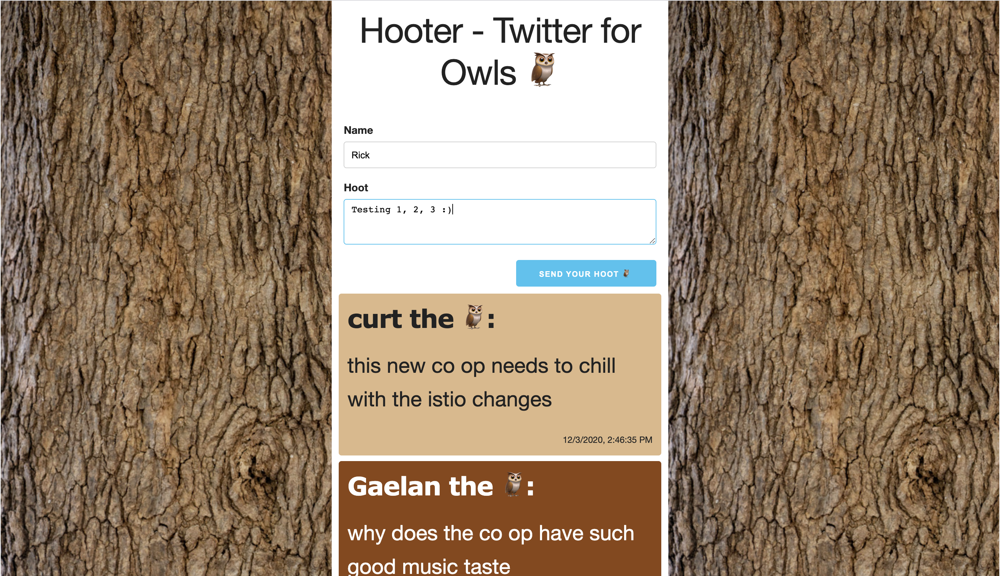

# Hooter - Twitter for Owls

A basic twitter clone built to demonstrate the full stack 🥞 (client, server, database). Inspired by CJ from TCG.

With the following features:

* Owls can send a hoot 🦉 ✉️
* Owls can see all hoots that have been sent 🦉 🗂

  

  

